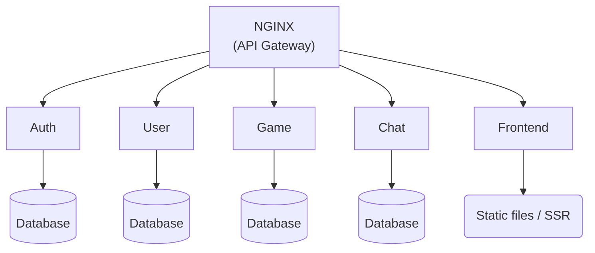

# High-Level Microservices Architecture



```mermaid
pie title Pets adopted by volunteers
    "Dogs" : 386
    "Cats" : 85
    "Rats" : 15
---

# Microservices Breakdown

## 1. Auth Service

Responsibilities:

- Registration/login (form + Google OAuth)
- JWT generation & verification
- 2FA setup and validation

Tech:

- Node.js + Fastify + JWT + TOTP
- Google OAuth2 library
- Database: stores credentials, 2FA secrets, token history

## 2. User Service

Responsibilities:

- Profile CRUD (username, avatar, languages)
- User stats & ranking
- Tournament logic (user assignment across games)

Tech:

- Node.js + Fastify
- raw SQLite

## 3. Game Service

Responsibilities:

- Manage Pong sessions (1v1 and multiplayer)
- Real-time game state updates via WebSocket
- Game result persistence

Tech:

- Node.js + WebSocket + game engine logic
- Physics loop per room

## 4. Chat Service

Responsibilities:

- Live chat channels (public/private)
- Message history storage
- Real-time messaging (WS)

Tech:

- Node.js + WebSocket
- Simple message persistence in SQLite

## 5. Frontend (SPA)

Responsibilities:

- Responsive UI with Tailwind CSS
- Multi-language support (i18n)
- UI for auth, game, chat, and profiles

Tech:

- React/Vue + Tailwind CSS
- i18next or Vue-i18n
- Deployed as static files or via SSR (optional)

---

# Backend vs Frontend Responsibilities

## Backend:

- Auth validation, OAuth, JWT

- Game logic and synchronization

- Chat message broadcasting and storage

- User data: profiles, stats, avatars

- SQLite DB read/write

- 2FA setup/verification

## Frontend:

- UI/UX (responsive layout, Tailwind styling)

- Language switcher and translations

- WebSocket client handling (game, chat)

- OAuth login flow (Google pop-up)

- Display user stats, chat messages, and Pong game