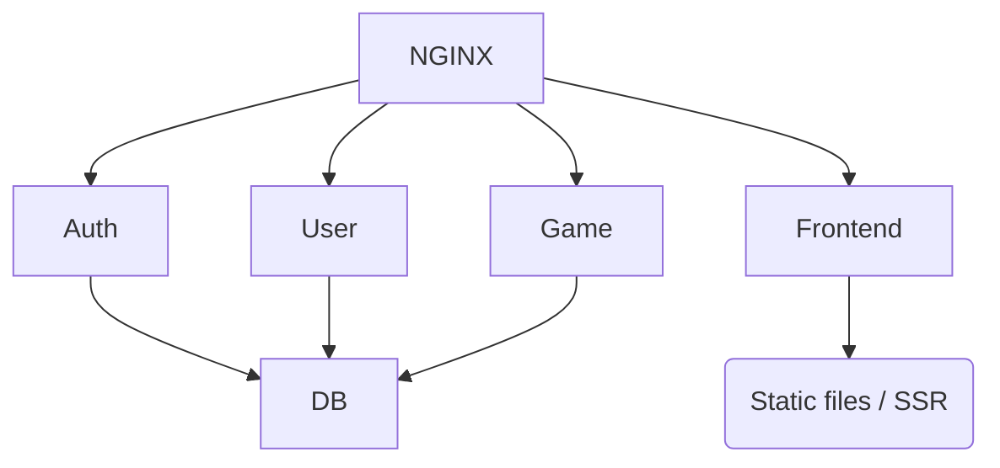

+----------------------+/
|        NGINX        |
|   (API Gateway)     |
+---+---+---+---+---+-+
	|   |   |   |   |
	v   v   v   v   v
[Auth] [User] [Game] [Chat] [Frontend]
	|       |     |      |       |
	[DB]   [DB]  [DB]   [DB]     [Static files / SSR]


```sequence
Alice->Bob: Hello Bob, how are you?
Note right of Bob: Bob thinks
Bob-->Alice: I am good thanks!
```

Here is a simple flow chart:

